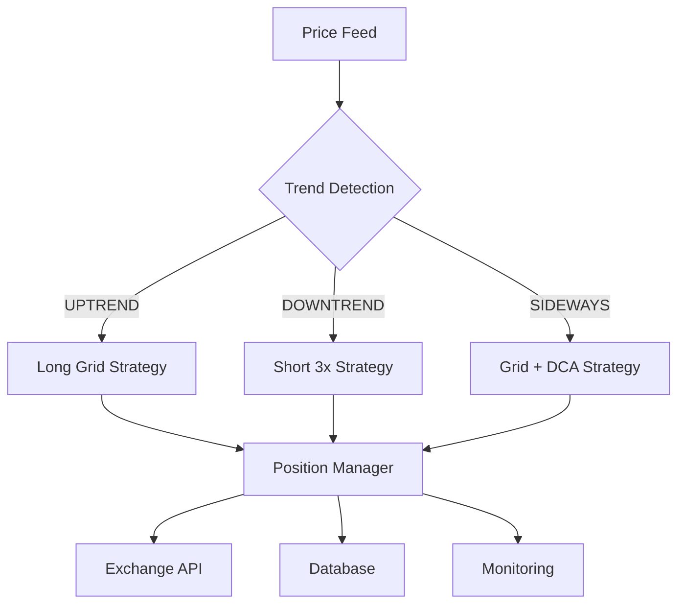

# Unified Crypto Trading Bot

Professional-grade automated trading system with adaptive strategies (LONG/SHORT/SIDEWAYS) for cryptocurrency markets.

[](https://www.python.org/downloads/)
[](https://opensource.org/licenses/MIT)

## 🎯 Features

- **Adaptive Strategy Switching**: Automatically detects market trends and switches between:
  - 📈 **UPTREND**: Long Grid Strategy
  - 📉 **DOWNTREND**: Short 3x Leverage
  - ➡️ **SIDEWAYS**: Grid + DCA Hybrid
  
- **Multi-Bot Architecture**: Run 3 risk profiles simultaneously (Low/Medium/High)
- **Risk Management**: Built-in position sizing, stop-loss, take-profit, liquidation protection
- **Paper Trading**: Test strategies without real money
- **Production Ready**: Docker, monitoring, logging, alerting

## 📁 Repository Structure

```
.
├── src/
│   ├── bots/              # Trading bot implementations
│   │   └── unified_bot.py # Main adaptive bot
│   ├── strategies/        # Trading strategies
│   │   ├── long_grid.py
│   │   ├── short_3x.py
│   │   └── sideways_dca.py
│   └── utils/             # Utilities
│       ├── rate_limiter.py
│       └── price_fetcher.py
├── config/                # Configuration files
│   ├── low_risk.json
│   ├── medium_risk.json
│   └── high_risk.json
├── infra/                 # Infrastructure as Code
│   ├── docker/
│   ├── k8s/
│   └── terraform/
├── scripts/               # Deployment & management scripts
├── docs/                  # Documentation
│   ├── ARCHITECTURE.md
│   ├── DEPLOYMENT.md
│   └── OPERATIONS.md
└── tests/                 # Test suite
```

## 🚀 Quick Start

### Prerequisites

```bash
# Ubuntu/Debian
sudo apt-get update
sudo apt-get install -y python3.10 python3-pip sqlite3 git

# Python dependencies
pip install ccxt pandas numpy aiohttp python-dotenv
```

### Installation

```bash
# Clone repository
git clone <repo-url>
cd unified-crypto-bot

# Set up environment
cp .env.example .env
# Edit .env with your API keys

# Initialize database
python3 scripts/init_db.py

# Start bots
./scripts/start_bots.sh
```

### Configuration

Create your config file:

```json
{
  "initial_capital": 100.0,
  "trend_lookback": 48,
  "trend_threshold": 0.05,
  "exchange": "hyperliquid",
  "symbol": "BTC/USDC:USDC",
  "testnet": true
}
```

## 🏗️ Architecture



See [docs/ARCHITECTURE.md](docs/ARCHITECTURE.md) for detailed design.

## 📊 Monitoring

```bash
# View live logs
tail -f memory/passivbot_logs/*/live.log

# Daily report
python3 scripts/daily_report.py

# Bot status
./scripts/status.sh
```

## 🔧 Infrastructure

### Docker

```bash
cd infra/docker
docker-compose up -d
```

### Kubernetes

```bash
kubectl apply -f infra/k8s/
```

See [docs/DEPLOYMENT.md](docs/DEPLOYMENT.md) for full infrastructure guide.

## 🧪 Testing

```bash
# Run backtests
python3 tests/backtest.py --config config/low_risk.json

# Paper trading
python3 src/bots/unified_bot.py --config config/paper.json --testnet

# Unit tests
pytest tests/
```

## 📝 License

MIT License - see [LICENSE](LICENSE) file.

## 🙏 Credits

Built with [ccxt](https://github.com/ccxt/ccxt) for exchange connectivity.