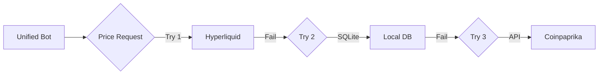

# Architecture Documentation

## System Overview

The Unified Crypto Trading Bot is a multi-strategy automated trading system designed for 24/7 operation with minimal human intervention.

## Core Components

### 1. Unified Bot (`src/bots/unified_bot.py`)

Main trading engine with adaptive strategy selection.

#### State Machine

```
┌─────────────┐
│   STARTUP   │
└──────┬──────┘
       │
       ▼
┌─────────────┐     Price History
│ COLLECTING  │◄─────(48h required)
│   DATA      │
└──────┬──────┘
       │
       ▼
┌─────────────┐
│  ANALYZING  │────► calculate_trend()
│    TREND    │
└──────┬──────┘
       │
       ├──────────► UPTREND ──► Long Grid
       ├──────────► DOWNTREND ► Short 3x
       └──────────► SIDEWAYS ─► Grid+DCA
```

#### Trend Detection Algorithm

```python
def detect_trend(prices: List[float]) -> Trend:
    """
    Uses 48h price history with hysteresis to prevent ping-pong.
    
    Thresholds:
    - UPTREND: > +5% change over lookback period
    - DOWNTREND: < -5% change over lookback period  
    - SIDEWAYS: Between -5% and +5%
    
    Hysteresis: 0.5% buffer at boundaries to prevent rapid switching.
    """
    change = (current_price / lookback_price) - 1
    
    if change > 0.05 + 0.005:  # 5% + hysteresis
        return "uptrend"
    elif change < -0.05 - 0.005:
        return "downtrend"
    else:
        return "sideways"
```

### 2. Strategy Implementations

#### Long Grid Strategy (UPTREND)

```
Entry: Price dips ≥ 0.8% from recent high
Position Size: 10% of capital per grid level
Take Profit: 0.6% above entry
Max Positions: Unlimited (until capital exhausted)
```

#### Short 3x Strategy (DOWNTREND)

```
Entry: Bounce ≥ 1.5% from recent low
Leverage: 3x
Position Size: 10-15% of capital
Take Profit: 3-4% below entry
Stop Loss: 2-2.5% above entry
Liquidation Buffer: 10%
```

#### Sideways Grid+DCA Strategy (SIDEWAYS)

```
Grid Levels: Support/Resistance from 48h range
Grid Entry: Near support zone
Grid Size: 30% of capital / 4 positions
DCA Trigger: Price drops 1.5% from entry
DCA Size: 70% of capital / 3 additions
Take Profit: 1% markup
Stop Loss: Below range low - 0.5%
```

### 3. Price Feed System

Multi-source fallback architecture:

1. **Primary**: Hyperliquid exchange API
2. **Secondary**: Local SQLite database (cron-populated)
3. **Tertiary**: External APIs (Coinpaprika, CoinGecko)



### 4. Risk Management

#### Position Sizing

```python
max_position_size = min(
    initial_capital * risk_percentage,  # e.g., 10%
    daily_loss_limit / stop_loss_distance  # Risk-based
)
```

#### Daily Loss Limit

```python
if daily_loss >= initial_capital * 0.05:  # 5% max daily loss
    stop_trading_for_today()
```

#### Liquidation Protection (Short positions)

```python
liq_buffer = entry_price * 1.33 * 0.90  # 10% buffer from liq price
if current_price >= liq_buffer:
    emergency_close()
```

### 5. Database Schema

```sql
-- Price history (populated by cron)
CREATE TABLE crypto_prices (
    id INTEGER PRIMARY KEY,
    timestamp TEXT,
    coin TEXT,
    price REAL,
    ath REAL,
    change_24h REAL,
    source TEXT
);

-- Trade history (populated by bot)
CREATE TABLE trades (
    id INTEGER PRIMARY KEY,
    timestamp TEXT,
    bot_id TEXT,
    strategy TEXT,
    side TEXT,  -- BUY/SELL
    amount REAL,
    price REAL,
    pnl REAL,
    reason TEXT  -- TP/SL/MANUAL
);

-- Bot state (checkpoints)
CREATE TABLE bot_state (
    bot_id TEXT PRIMARY KEY,
    current_trend TEXT,
    positions_json TEXT,
    stats_json TEXT,
    last_update TEXT
);
```

## Data Flow

```
┌─────────────┐
│   Cron Job  │ (Every 15 min)
└──────┬──────┘
       │ Fetch prices
       ▼
┌─────────────┐
│   SQLite    │
│   Database  │
└──────┬──────┘
       │ Read prices
       ▼
┌─────────────┐
│  Unified    │ (Every 60 sec)
│    Bot      │
└──────┬──────┘
       │ Analyze & Trade
       ▼
┌─────────────┐
│  Hyperliquid│
│   Exchange  │
└─────────────┘
```

## Multi-Bot Architecture

Three independent bot instances with shared database but isolated positions:

| Bot | Risk | Leverage | Position Size | Purpose |
|-----|------|----------|---------------|---------|
| Low | 5% daily | 1x max | 10% | Conservative, steady growth |
| Medium | 10% daily | 2x max | 10% | Balanced risk/reward |
| High | 15% daily | 3x max | 15% | Aggressive, higher variance |

Each bot:
- Has separate config file
- Logs to separate log file
- Maintains independent positions
- Shares price feed (cron)

## Rate Limiting

```python
RATE_LIMITS = {
    'coingecko': {'max_per_min': 25, 'delay': 2},
    'yahoo': {'max_per_hour': 80, 'delay': 5},
    'gold': {'max_per_15min': 4, 'delay': 3}
}
```

Counters reset:
- CoinGecko: Every 60 seconds
- Yahoo: Every 3600 seconds (1h)
- Gold: Every 900 seconds (15min)

## Error Handling

### Retry Logic

```python
max_retries = 3
backoff_seconds = [5, 15, 60]  # Exponential backoff
```

### Circuit Breaker

```python
consecutive_errors = 0
max_consecutive_errors = 10

if consecutive_errors >= max_consecutive_errors:
    pause_trading(minutes=30)
    notify_admin()
```

### Fallback Strategies

| Component | Primary | Fallback 1 | Fallback 2 |
|-----------|---------|------------|------------|
| Price | Hyperliquid | SQLite DB | Coinpaprika |
| Exchange | Hyperliquid | Binance | Paper mode |
| Database | Local SQLite | In-memory | File-based |

## Security Considerations

1. **API Keys**: Stored in environment variables, never in code
2. **Testnet First**: All strategies tested on testnet before live
3. **Daily Limits**: Hard stops prevent catastrophic losses
4. **Position Limits**: Max positions prevent overexposure
5. **Audit Logging**: All actions logged with timestamps

## Performance Targets

- **Latency**: < 2s from price update to order placement
- **Uptime**: > 99.5% (allowing for exchange maintenance)
- **Throughput**: 60 checks/minute per bot (3.6k/hour)
- **Memory**: < 100MB per bot process

## Scalability

Current design supports:
- 3 bots × 1 symbol = 3 concurrent strategies
- Easily extensible to multiple symbols
- Docker/Kubernetes ready for horizontal scaling

See [DEPLOYMENT.md](DEPLOYMENT.md) for scaling guidelines.